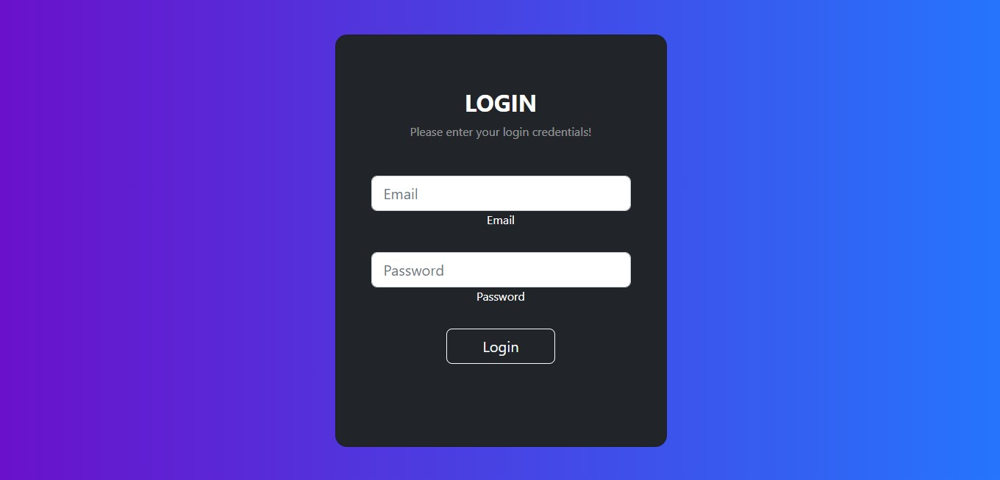
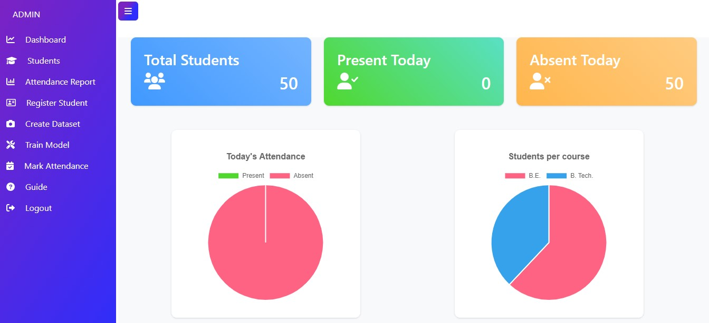
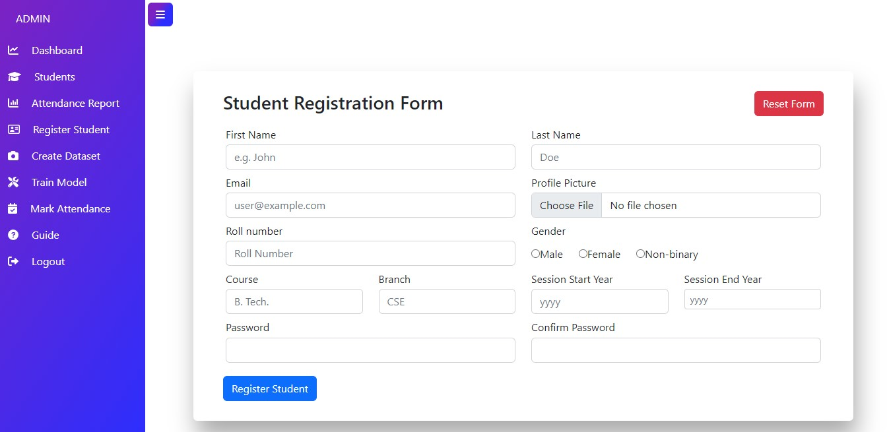
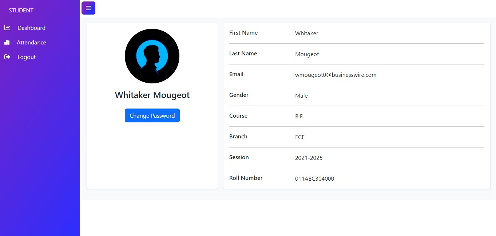
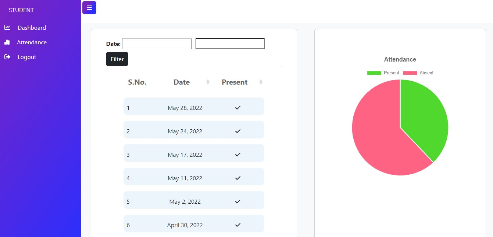

[](https://github.com/Minal-singh/SAMS/actions/workflows/SAMS.yml)

# Student Attendance Management System Created Using Django

[Project Demo on YouTube] https://youtu.be/KAnLCyCZOEM

And if you like this project, then ADD a STAR ⭐️  to this project 👆

## Features of this Project

### A. Admin Users Can
1. Register new student
2. Manage Students (Update and Delete)
3. View Student Attendance
4. Create dataset for students
5. Train Model
6. Mark Attendance
7. Export attendance sheet based on required filters
8. Help student for password recovery

### B. Students Can
1. View Attendance
2. Change password


## 📸 ScreenShots

**Login Page**



**Admin Portal**

AdminDashboard

StudentsPage

AttendancePage

RegisterPage


**Student Portal**

StudentDashboard

StudentAttendancePage



## How to Install and Run this project?

### Pre-Requisites:
1. Install Git Version Control
[ https://git-scm.com/ ]

2. Install Python Latest Version
[ https://www.python.org/downloads/ ]

3. Install Pip (Package Manager)
[ https://pip.pypa.io/en/stable/installing/ ]

*Alternative to Pip is Homebrew*

### Installation
**1. Create a Folder where you want to save the project**

**2. Create a Virtual Environment and Activate**

Install Virtual Environment First
```
pip install virtualenv
```

Create Virtual Environment

For Windows
```
virtualenv venv
```

Activate Virtual Environment

For Windows
```
venv\scripts\activate
```

**3. Clone this project**
```
git clone https://github.com/Minal-singh/SAMS
```

Then, Enter the project
```
cd SAMS
```

**4. Install Requirements from 'requirements.txt'**

For Windows
```
pip install https://github.com/Minal-singh/dlib/blob/master/dlib-19.23.0-cp39-cp39-win_amd64.whl?raw=true
pip install cmake
pip install -r requirements.txt
```
For Linux and Mac
```python
pip3 install -r requirements-linux.txt
```

**5. Collect Static**

Command for Windows:
```python
python manage.py collectstatic --no-input
```

**6. Now Run Server**

Command for Windows:
```python
python manage.py makemigrations main_app
python manage.py migrate
python manage.py runserver
```

**7. Login Credentials**

**Use Default Credentials**

*For Admin*
Email: admin@admin.com
Password: admin

*For Student*
Email: wmougeot0@businesswire.com
Password: password

**or create**
Create Super User
Command for Windows:
```
python manage.py createsuperuser
```

## Satisfying judging criteria
**Code Performance Optimization**
1. One time model training to reduce execution time.
2. Not storing attendance image to reduce memeory consumption.
3. Using default sqlite3 database of django to maintain database throughput and response time.

**Coding Best Practices**
1. Provided proper comments anywhere required, mostly in views.
2. Followed Python PEP8 convention for consistent indentation.
3. Maintained detailed naming convention that are self explanatory.
4. Implement the continuous integration using github actions.(CI/CD)
5. Test the application using python Unittest. Tests are not written for face recognition views as most of the part requires interaction with os and camera access.
6. The test coverage is 89% for the application.

**Functional Features**
1. Two type of user profiles- Admin and Student.
2. User authentication using email and password.
3. Student registration.
4. Stuedent management (Update and Delete).
5. Dataset creation using opencv.
6. Model training using kNN model.
7. Mark Attendance using face recognition at real time.
8. Data visualization using chartjs.
9. Export excel - attendance data using xlwt pacakage.
10. Form validation.
11. Filter attendance according to branch, session , course or date.
12. Guide for FAQs.

### The dev repository for this project is https://github.com/Minal-singh/AMS
