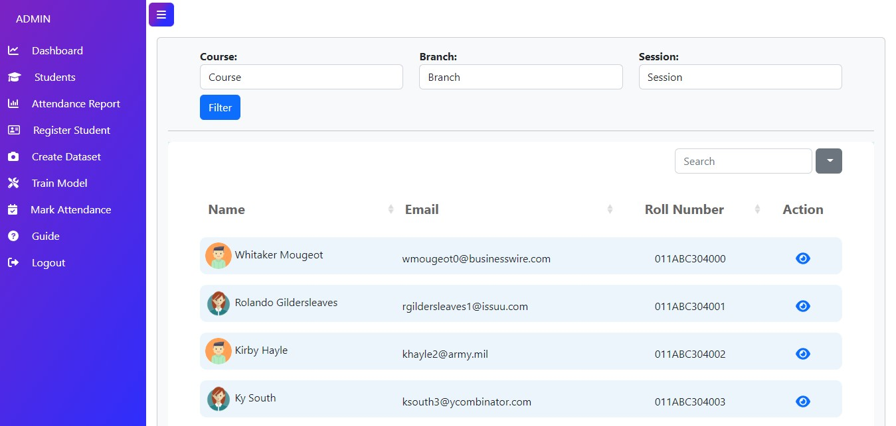
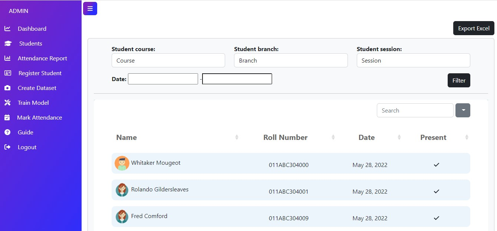

# Student Attendance Management System Created Using Django

## Features of this Project

### A. Admin Users Can
1. Register new student
2. Manage Students (Update and Delete)
3. View Student Attendance
4. Create dataset for students
5. Train Model
6. Mark Attendance
7. Help student for password recovery

### B. Students Can
1. View Attendance
2. Change password

## 📸 ScreenShots

**Login Page**

**Admin Portal**

AdminDashboard

StudentsPage

AttendancePage

RegisterPage

**Student Portal**

StudentDashboard

StudentAttendancePage

**Functional Features**
1. Two type of user profiles- Admin and Student.
2. User authentication using email and password.
3. Student registration.
4. Stuedent management (Update and Delete).
5. Dataset creation using opencv.
6. Model training using kNN model.
7. Mark Attendance using face recognition at real time.
8. Data visualization using chartjs.
9. Export excel - attendance data using xlwt pacakage.
10. Form validation.
11. Filter attendance according to branch, session , course or date.
12. Guide for FAQs.

